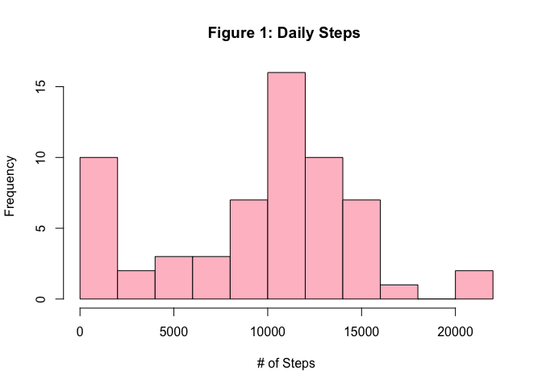
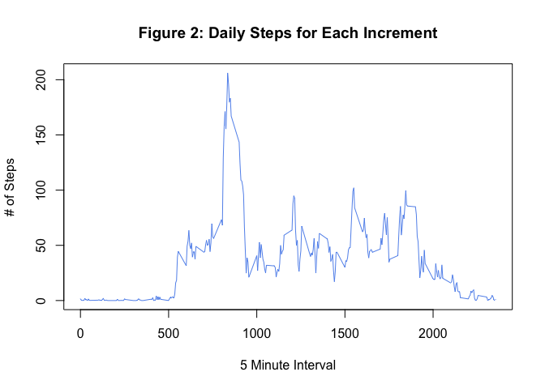
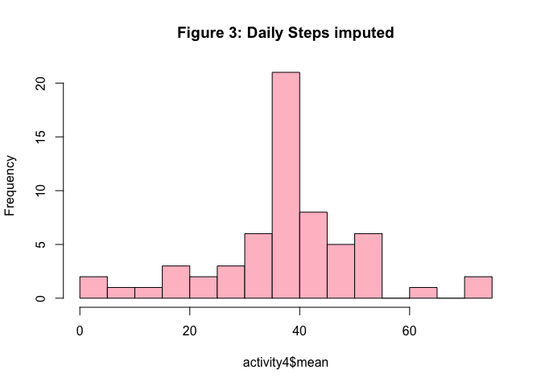
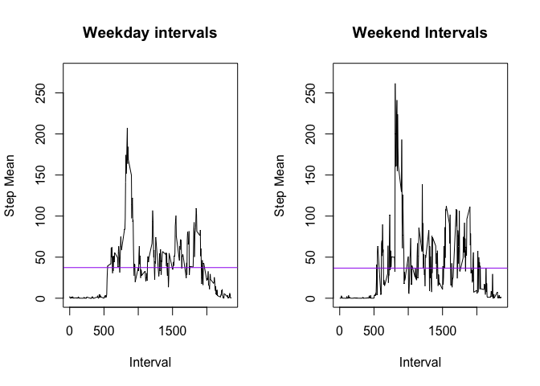

Reproducable Data Assignment 1 (week 2)
---------------------------------------

### By Aaron Traub

Summary
-------

This document is an exploration of steps monitored by an activity
tracker. The data has been collected at 5 minute intervals aross 61 days
tracking the number of steps taken.

Due to a large number of NAs in the dataset, the data is replaced with
the average for that interval across all of the days. This data is
graphed.

Lastly, I plot the difference between weekends and weekdays which shows
that weekends are slightly less active for the subject.

Dataset: Activity monitoring data \[52K\] Forked from:
(<http://github.com/rdpeng/RepData_PeerAssessment1>). **Note:** dataset
is download from the repo on 25 May 2016

Data Processing
---------------

### Load R Libraries

    library(chron)
    library (dplyr)

    ## 
    ## Attaching package: 'dplyr'

    ## The following objects are masked from 'package:stats':
    ## 
    ##     filter, lag

    ## The following objects are masked from 'package:base':
    ## 
    ##     intersect, setdiff, setequal, union

### Loading and preprocessing the data

        # Load data
        zipPath <- "./activity.zip"
        filePath <- "./activity.csv"
        unzip(zipPath)
        activity <- read.csv(filePath, header = TRUE)
        
        # convert date column to a date object
        activity$date <- as.Date(activity$date, format = "%Y-%m-%d" )

### Calculating date summary values

        # Calculate values
        meanSteps <- activity %>% group_by(date) %>% summarize  (mean(steps, na.rm =TRUE)) 
        names(meanSteps) <- c("date","steps")
        
        medianSteps <- activity %>% group_by(date) %>% summarize  (median(steps, na.rm =TRUE))
       
        sumSteps <- activity %>% group_by(date) %>% summarize  (sum(steps, na.rm =TRUE)) 
        names(sumSteps) <- c("date","steps")

### Histogram of the total number, mean & median steps taken each day

        hist(sumSteps$steps, breaks= 15, col="pink",xlab="# of Steps", main="Figure 1: Daily Steps ")

<!-- -->

        print (meanSteps)

    ## Source: local data frame [61 x 2]
    ## 
    ##          date    steps
    ##        (date)    (dbl)
    ## 1  2012-10-01      NaN
    ## 2  2012-10-02  0.43750
    ## 3  2012-10-03 39.41667
    ## 4  2012-10-04 42.06944
    ## 5  2012-10-05 46.15972
    ## 6  2012-10-06 53.54167
    ## 7  2012-10-07 38.24653
    ## 8  2012-10-08      NaN
    ## 9  2012-10-09 44.48264
    ## 10 2012-10-10 34.37500
    ## ..        ...      ...

        print (medianSteps)

    ## Source: local data frame [61 x 2]
    ## 
    ##          date median(steps, na.rm = TRUE)
    ##        (date)                       (dbl)
    ## 1  2012-10-01                          NA
    ## 2  2012-10-02                           0
    ## 3  2012-10-03                           0
    ## 4  2012-10-04                           0
    ## 5  2012-10-05                           0
    ## 6  2012-10-06                           0
    ## 7  2012-10-07                           0
    ## 8  2012-10-08                          NA
    ## 9  2012-10-09                           0
    ## 10 2012-10-10                           0
    ## ..        ...                         ...

### Time series plot of the average number of steps taken at given intervals

        meanStepsInt <- activity %>% group_by(interval) %>% summarize (mean(steps, na.rm =TRUE)) 
        names(meanStepsInt) <- c("interval","mean")
        plot(meanStepsInt, type="l", ylab="# of Steps", xlab="5 Minute Interval", col="cornflowerblue",  main="Figure 2: Daily Steps for Each Increment")

<!-- -->

        max(meanStepsInt) 

    ## [1] 2355

Imputing missing values
-----------------------

I imputed missing values by filling in NA values with intrval average
across days. Data was missing in large chunks likely caused by not
wearing the device for portions a day in general. To have the most
accurate data, it was more likely that an interval's mean would be more
accurate (users will likely perform common tasks ast common times during
the day) than daily average.

        numNA <- sum(is.na(activity)) 
        # meanNA <- mean(is.na(activity$steps))
        activityCount <- nrow(activity)
        # make a second variable
        activity2 <- activity

       
        print ("Summary numbers by interval including mean")

    ## [1] "Summary numbers by interval including mean"

        str (meanStepsInt)

    ## Classes 'tbl_df', 'tbl' and 'data.frame':    288 obs. of  2 variables:
    ##  $ interval: int  0 5 10 15 20 25 30 35 40 45 ...
    ##  $ mean    : num  1.717 0.3396 0.1321 0.1509 0.0755 ...

        summary (meanStepsInt)

    ##     interval           mean        
    ##  Min.   :   0.0   Min.   :  0.000  
    ##  1st Qu.: 588.8   1st Qu.:  2.486  
    ##  Median :1177.5   Median : 34.113  
    ##  Mean   :1177.5   Mean   : 37.383  
    ##  3rd Qu.:1766.2   3rd Qu.: 52.835  
    ##  Max.   :2355.0   Max.   :206.170

        max(meanStepsInt)

    ## [1] 2355

        activity3 <- merge (activity2, tbl_df(meanStepsInt), by="interval" )   
        names(activity3)[4] <- "intMean"
        activity3$newSteps <- mapply (ifelse , is.na(activity3$steps), activity3$intMean, activity3$steps)
        
        #output
        str (activity2)

    ## 'data.frame':    17568 obs. of  3 variables:
    ##  $ steps   : int  NA NA NA NA NA NA NA NA NA NA ...
    ##  $ date    : Date, format: "2012-10-01" "2012-10-01" ...
    ##  $ interval: int  0 5 10 15 20 25 30 35 40 45 ...

        print (meanStepsInt[max(meanStepsInt$mean),])

    ## Source: local data frame [1 x 2]
    ## 
    ##   interval     mean
    ##      (int)    (dbl)
    ## 1     1705 56.30189

        activity4 <- activity3 %>%
            arrange (newSteps) %>% 
            group_by(date) %>% 
            summarize  (mean(newSteps, na.rm =TRUE))
            names(activity4) <- c("date", "mean")
        
        hist(activity4$mean, breaks= 15, col="pink", main="Figure 3: Daily Steps imputed")

<!-- -->
Number of NA values: **2304**  
Number of observations: **17568**  
maximum Interval: \*\*\*\*

Difference between weekends & weekdays
--------------------------------------

### Panel plot comparing the average number of steps taken per 5-minute interval across weekdays and weekends

    # subset for weekends and weekdays

        activityWeekend <- activity3 %>%
            arrange (newSteps) %>% 
            filter (is.weekend(activity3$date)) %>% 
            group_by(interval) %>% 
            summarize (mean(newSteps, na.rm =TRUE))
            names(activityWeekend) <- c("interval", "mean")
            
        activityWeekdays <- activity3 %>%
            arrange (newSteps) %>% 
            filter (!is.weekend(activity3$date)) %>% 
            group_by(interval) %>% 
            summarize (mean(newSteps, na.rm =TRUE))
            names(activityWeekdays) <- c("interval", "mean")

Panel plot comparing the average number of steps taken per 5-minute
interval across weekdays and weekends

        par(mfrow=c(1,2))

        plot(activityWeekdays$interval, activityWeekdays$mean, main="Weekday intervals", type="l", ylab="Step Mean", xlab="Interval",  ylim=c(0,275))
        abline(h=mean(activityWeekdays$mean), col="purple")

        plot(activityWeekend$interval, activityWeekend$mean, main="Weekend Intervals", type="l", ylab="Step Mean", xlab="Interval",  ylim=c(0,275))
        abline(h=mean(activityWeekend$mean), col="purple")

<!-- -->

### Final Note

The weekend and week day average steps across days if nearly identical.
The Interval average on weekends had a greater range. It would be more
effective imputing data if the weekday and weekend interval mean were
imputed from individual subsets. Further analysis could be done on
individual day of the week.

### --The End--
